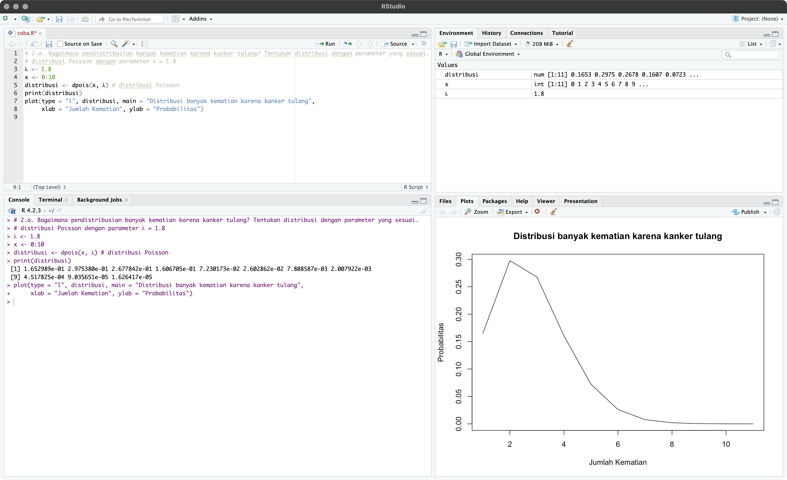
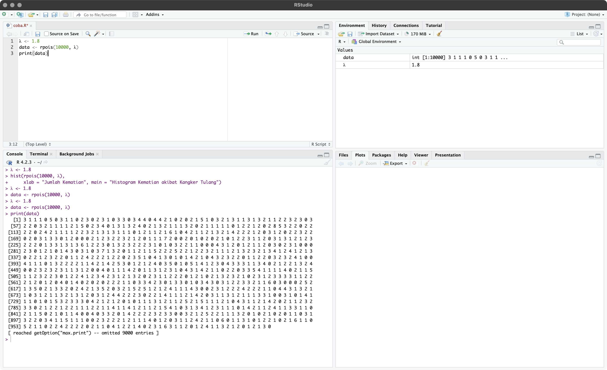

# Prak1_Probstat2023_C_5025211149

Praktikum 1 Probabilitas dan Statistika

## IDENTITAS

Nama  : Irsyad Firkiansyah Ramadhan

NRP   : 5025211149

Kelas : C

## SOAL 1

>Probabilitas seorang bayi yang baru lahir berjenis kelamin laki-laki adalah 0,488. Jika kita asumsikan bahwa dalam satu hari di rumah sakit terdapat 10 kelahiran, maka:

### 1-A

>Bagaimana pendistribusian banyak bayi laki-laki? Tentukan distribusi dengan parameter yang sesuai.

Pendistribusian yang digunakan pada permasalahan diatas adalah distribusi binomial. Dengan `n` sebagai jumlah kelahiran sebanyak 10, `p` sebagai probabilitas lahir laki-laki sebanyak 0.488, dan `x` sebagai banyak laki-laki yang lahir sebanyak 0 hingga 10. Dengan fungsi `dbinom()` akan didapatkan semua distribusi setiap banyak laki-laki yang lahir dari 0 hingga 10.

```R
n <- 10     # jumlah kelahiran
p <- 0.488  # probabilitas kelahiran laki-laki
x <- 0:n    # banyak bayi laki-laki
distribusi <- dbinom(x, n, p) 
print(distribusi)
plot(type = "l", distribusi, main = "Distribusi Bayi Laki-laki", 
     xlab = "Banyak Bayi Laki-laki", ylab = "Probabilitas")
```

  

### 1-B

>Berapa probabilitas bahwa tepat tiga bayi di antaranya berjenis kelamin laki-laki?

Penyelesaian dilakukan menggunakan `dbinom()`, seperti pada 1-a namun nilai x berubah menjadi 3. Akan didapatkan hasil sebesar 0.1286265

```R
n <- 10    
p <- 0.488  
x <- 3      
probabilitas <- dbinom(x, n, p) 
cat("probabilitas tepat tiga bayi laki-laki adalah", probabilitas)
```

  

### 1-C

>Berapa probabilitas bahwa kurang dari tiga bayi di antaranya berjenis kelamin laki-laki?

Penyelesaian dilakukan menggunakan `pbinom()` dengan x sebesar 2. Hasil yang akan dikeluarkan merupakan kumulatif x sebesar 2 yaitu 0.0636442

```R
n <- 10    
p <- 0.488  
x <- 2    
probabilitas <- pbinom(x, n, p) 
cat("probabilitas kurang dari tiga bayi adalah laki-laki adalah", probabilitas)
```

  

### 1-D

>Berapa probabilitas bahwa tiga atau lebih bayi di antaranya berjenis kelamin laki-laki?

Hasilnya sama dengan kumulatif x sama dengan 10 dikurangi x sama dengan 3, Sehingga dapat menggunakan fungsi sum() dengan x = 3:10 yang hasilnya adalah 0.9363558

```R
# 1d
n <- 10    
p <- 0.488  
x <- 3:n    
probabilitas <- dbinom(x, n, p) 
cat("probabilitas tiga atau lebih bayi adalah laki-laki adalah", sum(probabilitas))
```

  

### 1-E

>Berapa nilai harapan dan simpangan baku banyak bayi laki-laki?

Nilai harapan sama dengan rata-rata (`µ`) yaitu hasil dari perkalian `n` dan `p`, sedangkan simpangan baku merupakan akar dari varians (`σ²`) yaitu (`σ`)

```R
n <- 10    
p <- 0.488  
q <- 1 - p  
µ <- n * p       # rata-rata
σ2 <- n * p * q  # varians
σ <- sqrt(σ2)    # simpangan baku
cat("Nilai harapan banyak bayi laki-laki adalah ", µ, "\n")
cat("Simpangan baku banyak bayi laki-laki adalah ", σ)
```

  

### 1-F

>Gambarkan histogram pendistribusian banyak bayi laki-laki.

Menggunakan `rbinom()` untuk mendapatkan data secara random yang kemudian hasilkan akan dihistogramkan

```R
n <- 10    
p <- 0.488  
hist(rbinom(1000, n, p), 
     breaks = seq(-1, n + 1, by = 1), 
     xlab = "Banyak Bayi Laki-laki", 
     main = "Histogram Bayi Laki-laki")
```

  

## SOAL 2

>Misalkan banyak kematian karena kanker tulang untuk seluruh pekerja di pabrik ban dalam 20 tahun ke depan adalah 1.8

### 2-A

>Bagaimana pendistribusian banyak kematian karena kanker tulang? Tentukan distribusi dengan parameter yang sesuai.

Pendistribusian yang digunakan pada permasalahan diatas adalah distribusi possison. Penyelesaian dilakukan dengan menggunakan distribusi poisson dengan bantuan fungsi `dpois()`. Dengan `λ` sebagai mean sebesar 1.8 dan `x` sebagai jumlah kejadian sebesar 0 hingga 10

```R
λ <- 1.8  
x <- 0:10
distribusi <- dpois(x, λ) # distribusi Poisson
print(distribusi)
plot(type = "l", distribusi, main = "Distribusi banyak kematian karena kanker tulang", 
     xlab = "Jumlah Kematian", ylab = "Probabilitas")
```

  

### 2-B

>Ada 4 kematian akibat kanker tulang yang dilaporkan di kalangan pekerja pabrik ban, apakah itu peristiwa yang tidak biasa? Hitung probabilitas berdasarkan distribusi yang telah dipilih

Penyelesaian menggunakan `pois()` dengan x = 4, didapatkan hasil sebesar 0.07230173. Karena hasilnya kecil (0.07230173 atau 7.230173%) maka dapat dikatakan bahwa peristiwa tersebut tidak biasa

```R
λ <- 1.8  # rata-rata kematian
x <- 4    # jumlah kematian
probabilitas <- dpois(x, λ)
print(probabilitas)
```

  

### 2-C

>Berapa peluang paling banyak 4 kematian akibat kanker tulang?

Penyelesaian dapat menggunaakn `dpois()` dengan x = 4 yang didapatkan hasil 0.9635933

```R
λ <- 1.8  
x <- 4   
probabilitas <- ppois(x, λ)
print(probabilitas)
```

  

### 2-D

>Berapa peluang lebih dari 4 kematian akibat kanker tulang?

Penyelesaian dapat didapaktan dari 1 - peluang paling banyak 4 kematian akibat kangker tulang pada soal sebelumnya. Didapatkan hasil sebesar 0.03640666

```R
λ <- 1.8  
x <- 4   
probabilitas <- ppois(x, λ)
print(1 - probabilitas)
```

  

### 2-E

>Berdasarkan distribusi yang telah dipilih, berapakah nilai harapan dan standar deviasi banyak kematian akibat kanker tulang untuk pekerja pabrik ban?

Nilai harapan sama dengan rata-rata (`µ`) yaitu (`λ`), sedangkan simpangan baku merupakan akar dari varians (`σ²`) yaitu (`σ`)

```R
λ <- 1.8  
x <- 4   
µ <- λ         # rata-rata
σ2 <- λ        # varians
σ <- sqrt(σ2)  # standar deviasi
cat("Nilai harapan banyak kematian akibat kanker tulang ", µ, "\n")
cat("standar deviasi banyak kematian akibat kanker tulang ", σ)
```

  

### 2-F

>Gambarkan histogram pendistribusian banyak banyak kematian akibat kanker tulang untuk pekerja pabrik ban.

Menggunakan `rpois()` untuk mendapatkan data secara random dan kemudian hasil data akan dihistogramkan

```R
λ <- 1.8  
hist(rpois(10000, λ), 
     xlab = "Jumlah Kematian", 
     main = "Histogram Kematian akibat Kangker Tulang")
```

  

### 2-G

>Gunakan simulasi untuk memeriksa hasil sebelumnya.

Menggunakan `rpois()` untnuk mendapatkan data secara random sebagai simulai yang akan diujikan

```R
λ <- 1.8  
data <- rpois(10000, λ)
print(data)
```

  

### 2-H

>Jelaskan banyak kematian akibat kanker tulang berdasarkan simulasi Anda. Bandingkan jawaban pada pertanyaan 2d dengan hasil simulasi Anda

Menggunakan data random, hasil dari data tersebut kemudian dibandingkan dengan hasil dari soal nomer 2.d. Hasil yang didapatkan adalah 0.0378. Hasil tersebut tidaklah jauh dari hasil dari nomer 2.d. yaitu 0.03640666

```R
λ <- 1.8  
data <- rpois(10000, λ)
result <- sum(data > 4) / length(data)
print(result)
```


## SOAL 3

>Diketahui nilai x = 3 dan v = 10. Tentukan:

### 3-A

>Fungsi probabilitas dari distribusi Chi-Square.

Menggunakan fungsi `dchisq()` untuk mendapatkan nilai probabilitas dari distribusi Chi-Square dengan x = 3 dan v = 10

```R
x <- 3
v <- 10
probabilitas <- dchisq(x, df = v)
print(probabilitas)
```

  

### 3-B

>Histogram dari distribusi Chi-Square dengan 500 data acak.

Menggunakan fungsi `rchisq()`untunk mendapatkan data random, kemudian dihistogramkan

```R
x <- 3
v <- 10
hist(rchisq(500, x, df = x), main = "Distribusi Chi-Square")
```

  

### 3-C

>Nilai rataan (μ) dan varian (σ²) dari distribusi Chi-Square.

Nilai rataan (`μ`) dari distribusi Chi-Square adalah `v` dan varian (`σ²`) dari distribusi Chi-Square adalah `2` dikali `v`.

```R
x <- 3
v <- 10
µ <- v
σ2 <- 2 * v
cat("Nilai rataan (μ) dari distribusi Chi-Square adalah ", µ, "\n")
cat("Nilai dari distribusi Chi-Square adalah ", σ2, "\n")
```

  

## SOAL 4

>Diketahui data bangkitan acak sebanyak 100 dengan mean = 45 dan sd = 5.

### 4-A

>Fungsi probabilitas dari distribusi Normal P(X1 ≤ x ≤ X2), hitung z-scorenya dan plot data bangkitan acaknya dalam bentuk grafik. Petunjuk (gunakan fungsi plot()).

Sesuai dengan petunjuk yang didapatkan X1 ≤ x ≤ X2, maka dapat diasumsikan x1 = 44 dan x2 = 46. Setelah didapatkan z-scornya, dibuat plotnya menggunakan data random dengan mean dan standar deviansi yang telah ditentukan.

```R
set.seed(1) 
x1 <- 44
x2 <- 46
µ <- 45
σ <- 5
z1 <- (x1 - µ) / σ
z2 <- (x2 - µ) / σ
data <- rnorm(100, mean = µ, sd = σ)
plot(density(data), main = "Distribusi Normal", xlab = "Nilai Data")
abline(v = x1)
abline(v = x2)
```

  

### 4-B

>Gambarkan histogram dari distribusi Normal dengan breaks 50

Menambahakan `breaks` pada `hist()` untuk menampilkan histogram dengan breaks yang spesifik

```R
set.seed(1) 
µ <- 45
σ <- 5
data <- rnorm(100, mean = µ, sd = σ)
hist(data, breaks = 50, main = "Histogram Distribusi Normal")
```

  

### 4-C

>Nilai varian (σ²) dari hasil data bangkitan acak distribusi Normal.

Menggunakan fungsi `var()` pada data yang telah dibuat secara random untuk mendapatkan nilai variannya

```R
set.seed(1) 
µ <- 45
σ <- 5
data <- rnorm(100, mean = µ, sd = σ)
σ2 <- var(data)
print(σ2)
```

  

## SOAL 5

>Kerjakanlah menggunakan distribusi T-Student.

### 5-A

>Berapa probabilitas terjadinya suatu peristiwa acak X kurang dari -2,34 dengan 6 derajat kebebasan?

Menggunakan fungsi `pt()` untuk mendapatkan probabilitas menggunakan distribusi T-Student. Hasilnya adalah 0.02892197

```R
x <- -2.34
df <- 6
probabilitas <- pt(x, df = df)
print(probabilitas)
```

  

### 5-B

>Berapa probabilitas terjadinya suatu peristiwa acak X lebih dari 1,34 dengan 6 derajat kebebasan?

Menggunakan fungsi `pt()` untuk mendapatkan probabilitas menggunakan distribusi T-Student. Kali ini di-setting `lower.tail = FALSE` karena yang diinginkan adalah lebih dari (sisi kanan). Hasilnya adalah 0.11438

```R
x <- 1.34
df <- 6
probabilitas <- pt(x, df = df, lower.tail = FALSE)
print(probabilitas)
```

  

### 5-C

>Berapa probabilitas terjadinya suatu peristiwa acak X kurang dari -1,23 atau lebih besar dari 1,23 dengan 3 derajat kebebasan?

Probabilitas dapat didapatkan dengan menambahkan masing-masing probabilitas. Probabilitas pertama yaitu P(peristiwa acak X) kurang dari -1.23 dan kedua P(peristiwa acak X) lebih besar dari 1.23. Keduanya memiliki derajat kebebasan 3. Hasilnya adalah 0.306356

```R
x1 <- -1.23
x2 <- 1.23
df <- 3
probabilitas <- pt(x1, df = df) + pt(x2, df = df, lower.tail = FALSE)
print(probabilitas)
```

  

### 5-D

>Berapa probabilitas terjadinya suatu peristiwa acak X berada di antara -0,94 dan 0,94 dengan 14 derajat kebebasan?

Probabilitas dapat didapatkan dengan mengurangi peluang 0.94 dikurangi dengan peluang peluang -0.94. Hasilnya adalah 0.6368457

```R
x1 <- -0.94
x2 <- 0.94
df <- 14
probabilitas <- pt(x2, df = df) - pt(x1, df = df)
print(probabilitas)
```

  

### 5-E

>Berapa nilai t-score  dengan 5 derajat kebebasan yang memiliki luasan 0,0333 satuan persegi di bawah kurva dan di sebelah kiri t-score tersebut?

Menggunakan fungsi `qt()` dengan df = 5 dan alpha = 0.333, didapatkan hasil -2.337342

```R
df <- 5        
alpha <- 0.0333
t_score <- qt(alpha, df = df)
print(t_score)
```

  

### 5-F

>Berapa nilai t-score  dengan 25 derajat kebebasan yang memiliki luasan 0,125 satuan persegi di bawah kurva dan di sebelah kanan t-score tersebut?

Sama seperti pada soal sebelumnya, namun dicari bagian kanannya. dengan df = 25 dan alpha = 0.125, didapatkan hasil 1.177716

```R
df <- 25  
alpha <- 0.125
t_score <- qt(alpha, df = df, lower.tail = FALSE)
print(t_score)
```

  

### 5-G

>Berapa nilai t-score  dengan 11 derajat kebebasan yang memiliki luasan 0,75 satuan persegi di bawah kurva dan di antara t-score tersebut dan negatif dari nilai t-score tersebut?

```R
df <- 11
alpha <- 0.75
t_score <- qt(alpha, df = df)
negative_t_score <- qt(1 - alpha, df = df)
print(t_score)
print(negative_t_score)
```

  

### 5-H

>Berapa nilai t-score  dengan 23 derajat kebebasan yang memiliki luasan 0,0333 satuan persegi di bawah kurva dan di luar interval antara t-score tersebut dan negatif dari nilai t-score tersebut?

```R
df <- 23
alpha <- 0.0333
t_score <- qt(alpha, df = df)
negative_t_score <- qt(1 - alpha, df = df, lower.tail = FALSE)
print(t_score)
print(negative_t_score)
```

  

## Terima kasih
